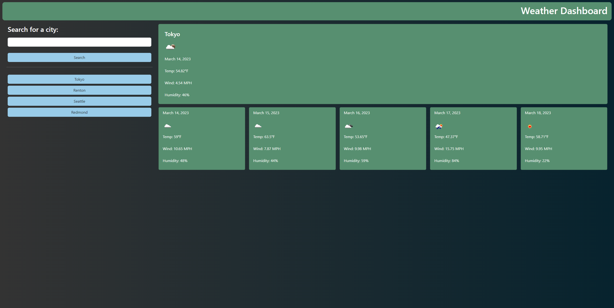

# Weather-Dashboard

## Description
This is a weather dashboard which presents the user with a way to view the current weather and 5-day weather forecast.
This dashboard uses a weather API and local storage. This application helps me futher my knowledge on server-side APIs.

## Installation
<a href="https://fgeorge206.github.io/Weather-Dashboard/">Weather-Dashboard</a>

## Usage
Enter a city to recieve the weather forcast.

## Credits
<a href="https://openweathermap.org/api"> Open Weather API </a>
 
Thank you <a href="https://github.com/BRosencrans">Brandon</a> and <a herf="https://github.com/claricetran">Clarice</a> for assistance on this assignment
